# galavanizecap1

## Getting the data

Data: https://www.speedrun.com/mc#Any_Glitchless

When I was exploring the website it didn't go to a special url for the data. So I had to figure out a way to get the data. Since I have web page experience I knew that I could look in the network tab to see were request where being made. I saw that it was getting the tables with an AJAX request. So I took the url it requested from and scraped from there. 

I then cleaned the data up and made Panda dataframes out of the data. After that I wrote them down to CSV so I didn't have to be constantly requesting from the server.

I wanted to combine some of the Tables so that I can compare the data. So I combined the tables into there respective groups and one that is all of the data. 

## Analyzing

## Images

<!-- 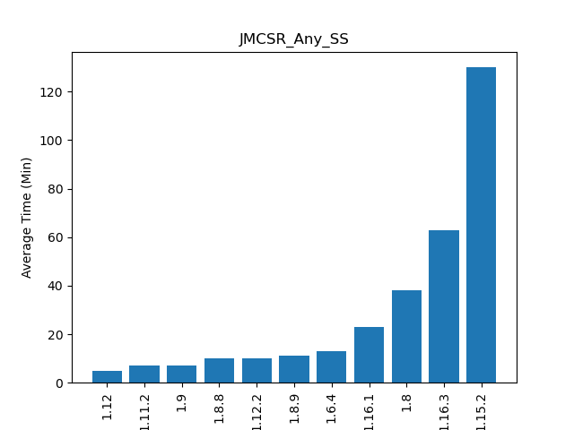
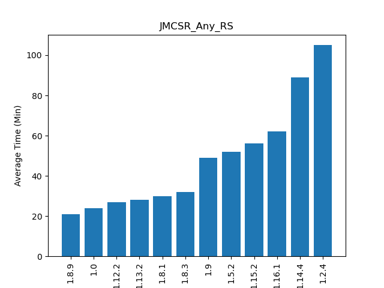
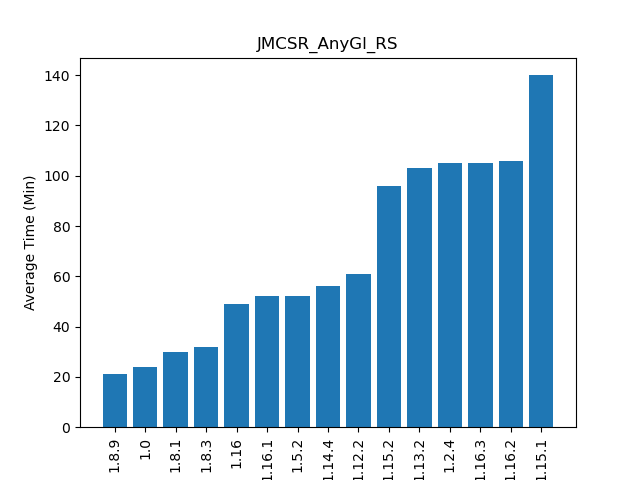
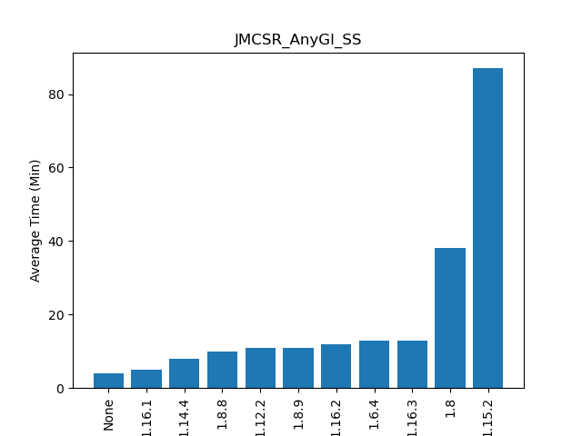 -->

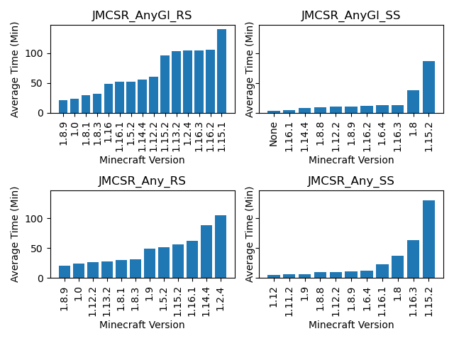
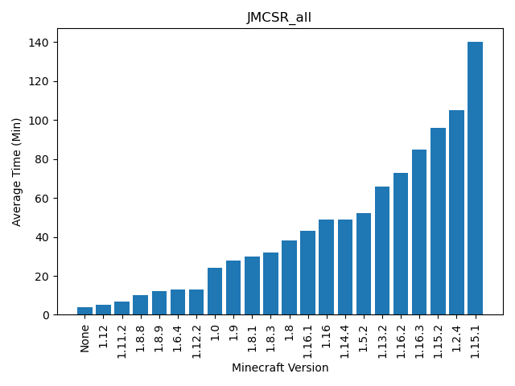

<!-- 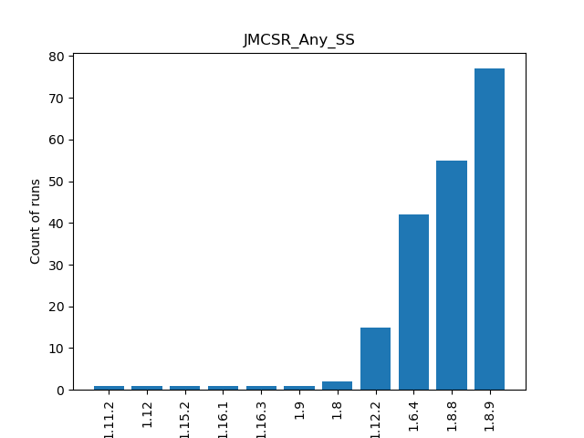
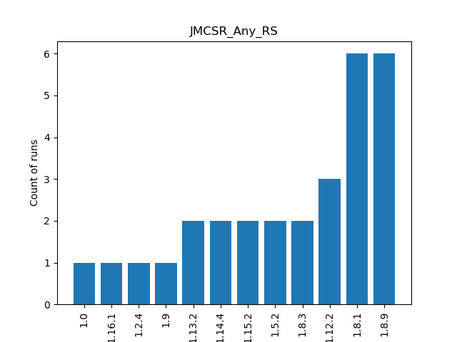
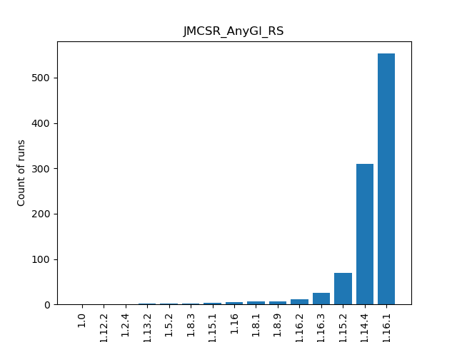
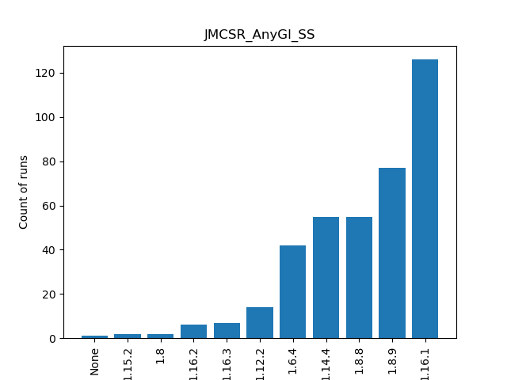 -->

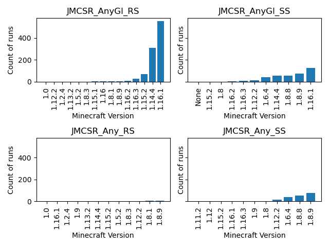
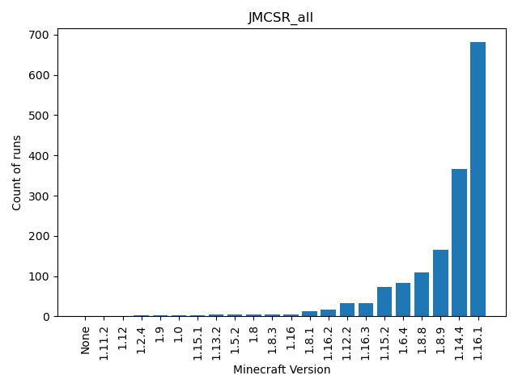

## Hypothesis

After seeing the images above I wonder what would be faster, Glitchless or Glitched.

Null: Neither version of Speedrunning is significatly faster then the other.
Alternate: Glitched Minecraft Speedruns are faster then Glitchless Minecraft Speedruns.

significance level = 5%