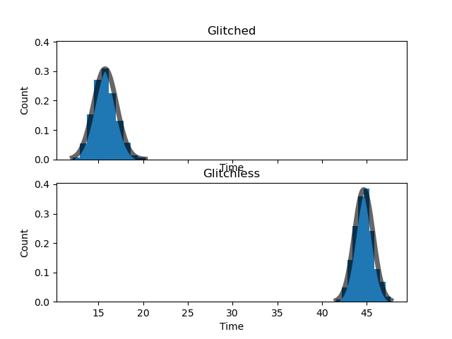

# galavanizecap1

## Getting the data

Data: https://www.speedrun.com/mc

When I was exploring the website to get the data it didn't go to a special url for the data. So I had to figure out a way to get the data. What helped me was that I have web page experience and I knew that I could look in the network tab to see were the web page request where being made to. I saw that it was getting the tables with an AJAX request. So I took the url it requested from and scraped from there. 

I then cleaned the data into Panda dataframes. After that I wrote them down to CSV so I didn't have to be constantly requesting from the server.

I then wanted to combine some of the Tables so that I can compare the data of different types of speedrunning.

```Python
def mcsr_csv_maker(url, key):
    # Make the request to the server
    response = requests.get(url)
    # takes the response and put it through BeautifulSoup
    soup = BeautifulSoup(response.text, "html.parser")
    # Gets all the table data
    leaderboard = soup.findAll("td")
    # The string where the data is put
    r_txt = "Rank,Player,Real time,In-game time,Time,Version,Difficulty,F3,Mods,Date,,"
    # Loops through the TD and adds them to the string
    for it in leaderboard:
        r_txt += (
            it.text if it.text != "" else "" if "small" in it.attrs["class"] else "None"
        )
        r_txt += ","
    # Reads the string made above as a CSV to make a Dataframe
    df = pd.read_csv(io.StringIO(r_txt.replace(",,", "\n")), sep=",")
    # Makes sure the name is correct
    df["Player"] = df["Player"].apply(lambda x: x[0 : len(x) // 2])
    # Turns the date into correct form
    df["Date"] = df["Date"].apply(lambda x: x.replace(" ", ""))
    df["Date"] = pd.to_datetime(df["Date"], format="%d%b%Y")
    # Makes the time into time deltas
    df["Real time"] = df["Real time"].apply(convert_to_ms)
    df["In-game time"] = df["In-game time"].apply(convert_to_ms)
    df["Real time"] = pd.to_timedelta(df["Real time"], unit="ms")
    df["In-game time"] = pd.to_timedelta(df["In-game time"], unit="ms")
    # Writes the Dataframe to a csv file
    df.to_csv("./data/versions/{}.csv".format(key), index=False)
```

## Intial look

I didn't know what to test at first so I decide to graph the times to see what I could look into.

<!-- These are the bigger images of the subplots
    
    
    
     
-->

The first set of graph are the average speedrun times for the different version of minecraft in there respective categories and then all of them together.


<!-- These are the bigger images of the subplots
    
    
    
     
-->

The second set of graph are the count of speedruns for the different version of minecraft in there respective categories and then all of them together.


## Hypothesis

After seeing the images above I started wondering what would be faster, Glitchless or Glitched speedruns.

Null: Neither version of Speedrunning is significantly faster then the other.

Alternate: Either Glitched or Glitchless speedruns are faster.

significance level = 5%



Test results:
 - Standard Error of the Means
   - Glitched: 0.04066640645942682 
   - Glitchless: 0.03318517320541225
 - Degree: 1920.7514999618993 
 - Tests stat: -552.9625199007932
 - p value: 0.0

Glitched Minecraft speedruns are significantly faster thean glitchless speedruns since the p value is under the significant value, so the null hypotheses is rejected.

# Next

What more I could do is test what version of Minecraft are faster to speedrun.